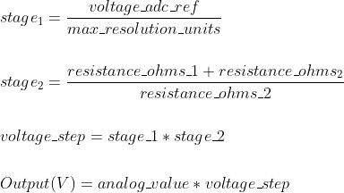

# Introduction
The folder contains code for the Universal Ventilator project.

# Setup
The hardware used in this project uses an Arduino Due. This project has been developed using VSCode and PlatformIO as an extension.

Both of the above are open source. Using PlatformIO with VSCode offers alot of flexibility, and also extensions for development and debugging.

## Hardware Setup

### Downloading code
**Recommended**:
The firmware for this project is verly large and occupies almost 90% of the flash. Using the USB port to download and/or debug code is not recommended as it will take almost 2-3 minutes to upload code.

The recommended hardware to debug is the [Segger J-Link Educational probe](https://www.segger.com/products/debug-probes/j-link/models/j-link-edu-mini/).

Connect the USB end of the J-Link to the PC and the 10-pin connector on the other end goes to the JTAG port on the Arduino Due.

### Debugging code
Connect a USB cable between the PC and the USB connector away from the push button. This will give a serial port where print statements can be viewed and commands can be sent to the ventilator via a command set. 

## Environment Setup

### Install VSCode
Install the latest VSCode for your architecture from [code.visualstudio.com](https://code.visualstudio.com/download)

### Install Platform IO IDE
Open VSCode and browse to the extensions tab(on the right side). Search for PlatformIO and install it.

### Install Segger J-Link Software
If the Segger J-Link probe is being used, download and install the software for your architecture from [Segger](https://www.segger.com/downloads/jlink/).

On Windows, if PlatformIO throws a *Jlink.exe not found* error, add the J-Link folder to the Path, under Environmental Variables.

## Workspace Setup

### Opening the project
Open VS code, click File->Open... and browse to the source/ folder. This should be the root folder for vscode to pick up the PlatformIO setup file(platformio.ini)

### Choose a PlatformIO Environment
In order to build and upload, one of the PlatformIO build environments must be selected.\
In the VSCode toolbar, the environment may be labelled as `Default (Universal Ventilator)`.\
To avoid confusion it is recommended to change your env from default.

#### due-common
The default option, uses the `Programming Port` to upload to the Arduino.

#### due-jlink
Select this if using a JLink device. Provides faster upload through the JTag port, as well as PlatformIO debugging features

### Serial Monitor
Click the plug icon in the bottom toolbar to open a serial monitor window.

### Building the Project

Click the checkmark(✓) on the bottom toolbar to start a build

### Uploading the Project

Select the right arrow(→) to upload code to the Arduino.

# Transforms
## Pressure Sensor Equations

- Equation taken from data
  sheet https://sensing.honeywell.com/honeywell-sensing-trustability-ssc-series-standard-accuracy-board-mount-pressure-sensors-50099533-a-en.pdf

#### Output

> 

#### Solve for Pressure, multiply through and sub in constants:

> 

#### Final equation used to get the pressure:

> 

#### Voltage Step Equations:

> 

#### Constants:

> 

The images for the equations were created with https://www.codecogs.com/latex/eqneditor.php.